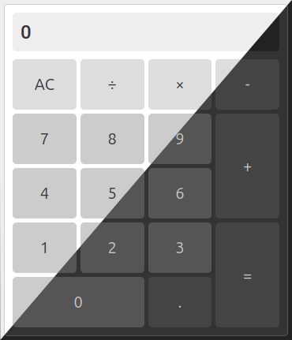

# PlusOne Calculator

You gotta have a calculator in your portfolio, and here's mine. The layout is made with CSS Grid. PlusOne has light and dark themes and adjust according to the settings in the operating system. Also a few progressive enhancements like installability and offline support are in place. PlusOne just got updated with support for the numpad, if you have one of those on your computer keyboard.
